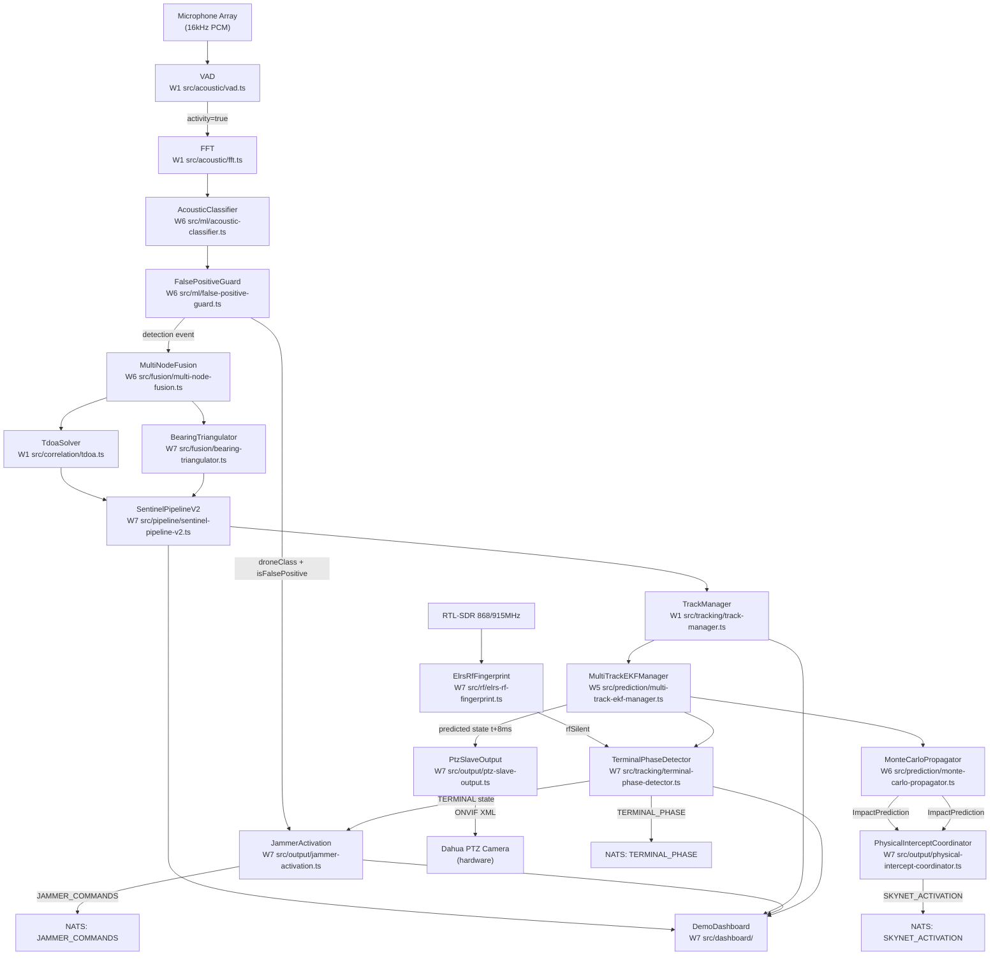

# APEX-SENTINEL — INTEGRATION_MAP.md
## Wave 7: Hardware Integration + Data Pipeline Rectification + Terminal Phase
## Version: 7.0.0 | Date: 2026-03-25 | Status: APPROVED

---

## 1. INTEGRATION MAP OVERVIEW

W7 introduces a hardware output layer (PTZ, jammer, SkyNet net-gun) on top of the W1-W6 detection and prediction stack. The 3-Layer Protection Stack defines the cascade:

```
Layer 1: Acoustic + RF detection → EKF track → bearing output to PTZ camera (ONVIF, Dahua)
Layer 2: Classification → jammer activation (FPV=900MHz, Shahed=GPS 1575MHz)
Layer 3: MonteCarloPropagator impact zone → SkyNet net-gun pre-position + fire command
```

All three layers run in parallel, triggered by the same underlying detection event. They are not sequential — Layer 3 does not wait for Layer 2, and Layer 2 does not wait for Layer 1.

---

## 2. TOP-LEVEL DATA FLOW (MERMAID)



---

## 3. INTERNAL MODULE INTEGRATION MAP

### 3.1 Data Ingestion Chain (Acoustic)

```
Microphone (16kHz PCM Float32Array)
  │
  ▼
VAD (W1: src/acoustic/vad.ts)
  │ boolean: activity detected
  │ [IF activity=false → discard frame, no downstream processing]
  ▼
FFT (W1: src/acoustic/fft.ts)
  │ Float32Array: magnitude spectrum
  │ number: dominant frequency f0
  ▼
AcousticClassifier (W6: src/ml/acoustic-classifier.ts)
  │ ClassificationResult {
  │   label: 'shahed-136'|'shahed-131'|'shahed-238'|'gerbera'|'lancet-3'|'fpv'|'unknown',
  │   confidence: 0-1,
  │   modelClass: 'piston'|'turbine'|'electric'|'unknown'   ← NEW W7
  │ }
  ▼
FalsePositiveGuard (W6: src/ml/false-positive-guard.ts)
  │ AssessmentResult {
  │   shouldAlert: boolean,
  │   isFalsePositive: boolean,   ← consumed by JammerActivation
  │   suppressionReason: string | null
  │ }
  │ [IF isFalsePositive=true → emit to FP suppression log, stop downstream alert path]
  ▼
AcousticDetectionEvent {
  id, nodeId, detectedAt, droneClass, confidence, position, snr, dopplerRate
}
  │
  ├──→ NATS publish: sentinel.detections.{nodeId}
  └──→ SQLite offline buffer (when NATS unavailable)
```

---

### 3.2 RF Chain (ELRS Fingerprinting)

```
RTL-SDR / SDR device (868MHz or 915MHz monitor)
  │ ElrsBurstObservation { timestampMs, frequencyMHz, rssiDbm, burstDurationUs }
  ▼
ElrsRfFingerprint (W7: src/rf/elrs-rf-fingerprint.ts)
  │ ElrsPacketStats {
  │   observedPackets, expectedPackets, packetLossRate,
  │   meanIntervalMs, intervalStdDevMs,
  │   isElrsLike: boolean
  │ }
  │
  ├─── [IF isElrsLike=true AND packetLossRate > 0.8 for >= 2s]
  │         ▼
  │    RfSilentEvent { trackId, rfSilent: true, silenceDurationMs }
  │         │
  │         └──→ TerminalPhaseDetector (W7)  ← rfLinkSilent indicator
  │
  └─── [IF isElrsLike=true AND packetLossRate < 0.2]
            ▼
       RfSilentEvent { rfSilent: false }  ← abort/resume signal
            │
            └──→ TerminalPhaseDetector (W7)  ← rfLinkSilent=false
```

---

### 3.3 Fusion Chain

```
NATS consumer: sentinel.detections.>  (all nodes)
  │ AcousticDetectionEvent[]
  ▼
MultiNodeFusion (W6: src/fusion/multi-node-fusion.ts)
  │
  ├──→ TdoaCorrelator (W2) → TdoaSolver.solve() → {lat, lon, confidence}
  │
  └──→ BearingTriangulator (W7: src/fusion/bearing-triangulator.ts)
            │ BearingReport[] from:
            │   - Fixed acoustic nodes (weight 1.0)
            │   - MobileNodeReporter via BEARING_REPORTS NATS subject (weight 0.4)
            ▼
       TriangulationResult { lat, lon, confidenceM, degenerate }
  │
  ▼
SentinelPipelineV2 (W7: src/pipeline/sentinel-pipeline-v2.ts)
  │ PipelinePositionResult {
  │   lat: number | null,     ← null if no convergent solution (never fake coord)
  │   lon: number | null,
  │   source: 'tdoa'|'bearing'|'fused'|null,
  │   confidenceM: number | null,
  │   fallbackUsed: false     ← ALWAYS false (no hardcoded coordinate fallback)
  │ }
  ▼
TrackManager (W1: src/tracking/track-manager.ts)
  │ Track { id, status, droneType, position, confidence }
  ▼
MultiTrackEKFManager (W5: src/prediction/multi-track-ekf-manager.ts)
  │ EKFState { lat, lon, alt, vLat, vLon, vAlt, covarianceDiag }
  │
  ├──→ PolynomialPredictor (W5) → 5-horizon trajectories
  ├──→ ImpactEstimator (W5) → ground intersection point
  └──→ MonteCarloPropagator (W6) → ImpactPrediction { lat, lon, confidence, radiusM }
```

---

### 3.4 Terminal Phase Detection Chain

```
MultiTrackEKFManager
  │ EKFState per track (lat, lon, alt, vLat, vLon, vAlt)
  │
  ▼                               ElrsRfFingerprint
TerminalPhaseDetector (W7)  ←──── rfSilent: boolean
  │
  │ TerminalPhaseIndicators {
  │   speedExceedsThreshold:    √(vLat² + vLon²) > 35 m/s
  │   headingLockedToTarget:    heading variance < 8° over last 10 updates
  │   altitudeDescentRate:      vAlt < -2.0 m/s AND alt < 500m AGL
  │   rfLinkSilent:             from ElrsRfFingerprint.rfSilent
  │ }
  │
  │ FSM: CRUISE → APPROACH → TERMINAL → IMPACT
  │
  ├──→ NATS publish: TERMINAL_PHASE
  │      TerminalPhaseResult {
  │        trackId, currentState, indicators, lastTransition, confidence
  │      }
  │
  ├──→ JammerActivation (W7)  ← on TERMINAL transition
  └──→ AlertStore (W4)        ← CRITICAL alert on TERMINAL
```

---

### 3.5 Layer 1 — PTZ Output Chain (Optical Tracking)

```
MultiTrackEKFManager
  │ predicted state at t+8ms (bearing lead compensation)
  ▼
PtzSlaveOutput (W7: src/output/ptz-slave-output.ts)
  │
  │ 100Hz loop:
  │   1. Get EKF predicted state at now+8ms
  │   2. Compute bearingDeg (0-360) from predicted lat/lon relative to camera
  │   3. Compute elevationDeg from predicted alt relative to camera mount
  │   4. Build OnvifRelativeMovePayload
  │   5. HTTP POST to Dahua camera ONVIF endpoint
  │
  │ PtzBearingCommand {
  │   trackId, bearingDeg, elevationDeg, panSpeedNorm, tiltSpeedNorm, predictedAt
  │ }
  │
  ├──→ OnvifClient.RelativeMove() → Dahua PTZ camera (hardware)
  │      [Fallback: AbsoluteMove() on RelativeMove HTTP 400]
  │
  └──→ NATS publish: PTZ_BEARING (QoS: at-most-once, no redelivery)
```

**ONVIF XML payload format:**

```xml
<PTZRequest>
  <RelativeMove>
    <ProfileToken>Profile_1</ProfileToken>
    <Translation>
      <PanTilt x="{panDeltaNorm}" y="{tiltDeltaNorm}"
               space="http://www.onvif.org/ver10/tptz/PanTiltSpaces/TranslationGenericSpace"/>
    </Translation>
    <Speed>
      <PanTilt x="{panSpeed}" y="{tiltSpeed}"/>
    </Speed>
  </RelativeMove>
</PTZRequest>
```

---

### 3.6 Layer 2 — Jammer Activation Chain

```
AcousticClassifier
  │ droneClass, confidence
  │
FalsePositiveGuard
  │ isFalsePositive: boolean
  │
TerminalPhaseDetector
  │ currentState: TerminalPhaseState
  │
  ▼
JammerActivation (W7: src/output/jammer-activation.ts)
  │
  │ DroneClass → Channel map:
  │   fpv          → 900MHz  (ELRS/FrSky RC link)
  │   shahed-136   → 1575MHz (GPS L1 navigation)
  │   shahed-131   → 1575MHz
  │   shahed-238   → 1575MHz (turbine Shahed, GPS-navigated)
  │   gerbera      → 1575MHz
  │   lancet-3     → 900MHz  (FPV loitering munition RC link)
  │   unknown      → disabled
  │
  │ Gates (ALL must pass):
  │   isFalsePositive === false
  │   droneClass !== 'unknown'
  │   confidence >= 0.85
  │   no active command for same trackId
  │
  ▼
JammerCommand { commandId, trackId, droneClass, channel, activateAt, durationMs }
  │
  └──→ NATS publish: JAMMER_COMMANDS (JetStream durable, consumer: jammer-controller)
```

---

### 3.7 Layer 3 — Physical Intercept Chain (SkyNet)

```
MonteCarloPropagator (W6)
  │ ImpactPrediction {
  │   lat, lon, altM,
  │   impactTimeS,          unix seconds
  │   confidence: 0-1,      from Monte Carlo distribution
  │   radiusM               1σ uncertainty radius
  │ }
  ▼
PhysicalInterceptCoordinator (W7: src/output/physical-intercept-coordinator.ts)
  │
  │ SkyNetUnitRegistry query:
  │   1. getNearestUnit(impactPrediction.lat, impactPrediction.lon)
  │   2. Check unit.status === 'ready'
  │   3. Check haversineDistance(unit, impact) <= unit.maxRangeM
  │
  │ Confidence gate: impactPrediction.confidence > 0.6
  │
  │ Fire timing:
  │   fireAtS = impactTimeS - (haversineDistance / projectileSpeedMs)
  │
  ▼
SkyNetFireCommand {
  commandId, unitId, bearing, elevationDeg,
  fireAtS, trackId, impactPrediction, confidenceGate
}
  │
  └──→ NATS publish: SKYNET_ACTIVATION (JetStream durable, consumer: skynet-controller)
```

---

### 3.8 Demo Dashboard Integration

```
SentinelPipelineV2
  │ PipelinePositionResult (per track, per detection cycle)
  ▼
Supabase tracks table (real-time enabled)
  │ row insert/update on track position change
  ▼
DemoDashboard SSE Route (/api/tracks/sse)
  │ Supabase real-time subscription → EventSource stream
  ▼
Browser (Next.js client)
  │ useTrackSse() hook → Zustand track store
  │
  ├──→ TrackMap (Leaflet): renders track markers + predicted trajectory
  ├──→ ThreatHeatmap (Leaflet.heat): detection density overlay
  ├──→ AlertLog: unacknowledged alerts, severity colour-coded
  └──→ OperatorStatus: node count, active tracks, last detection, health

Additional SSE feeds:
  NATS: TERMINAL_PHASE → SSE: terminal_phase_event → TrackMap marker turns red
  NATS: JAMMER_COMMANDS → SSE: jammer_event → AlertLog entry
  NATS: SKYNET_ACTIVATION → SSE: skynet_event → Dashboard intercept overlay
```

---

## 4. NATS JETSTREAM SUBJECT MAP (COMPLETE W1-W7)

| Subject Pattern | Publisher | Consumer(s) | W Introduced | QoS |
|----------------|-----------|-------------|--------------|-----|
| `sentinel.detections.{nodeId}` | AcousticPipeline (per node) | MultiNodeFusion | W1 | durable |
| `sentinel.tracks.{trackId}` | TrackManager | DemoDashboard, AlertStore | W1 | durable |
| `sentinel.alerts` | AlertStore | TelegramBot, DemoDashboard | W2 | durable |
| `sentinel.predictions.{trackId}` | PredictionPublisher | DemoDashboard, MonteCarlo | W5 | durable |
| `BEARING_REPORTS` | BearingTriangulator, MobileNodeReporter | MultiNodeFusion | W7 | durable |
| `PTZ_BEARING` | PtzSlaveOutput | Dahua ONVIF bridge | W7 | at-most-once |
| `JAMMER_COMMANDS` | JammerActivation | jammer-controller | W7 | durable |
| `SKYNET_ACTIVATION` | PhysicalInterceptCoordinator | skynet-controller | W7 | durable |
| `TERMINAL_PHASE` | TerminalPhaseDetector | AlertStore, DemoDashboard, JammerActivation | W7 | durable |

**QoS notes:**
- `PTZ_BEARING` is at-most-once because stale bearing commands are worse than no command — the camera should not act on a 500ms-old bearing
- All other W7 subjects are durable because missed activation commands must not be silently lost

---

## 5. EXTERNAL SYSTEM INTEGRATIONS

### 5.1 Dahua PTZ Camera (ONVIF)

```
Integration type: HTTP/SOAP (ONVIF WS-PTZ)
Authentication: HTTP Digest (username/password in OnvifPtzConfig)
Protocol: SOAP over HTTP, ONVIF Profile S
Command: PTZ.RelativeMove (primary) / PTZ.AbsoluteMove (fallback)
Publish rate: 100Hz
Tested in W7: MOCK only (not real hardware)
Real hardware test: W8 field trial
Error handling: TCP timeout → log + skip cycle, no crash
```

ONVIF discovery (for W8 field deployment):
```
ws-discovery broadcast on UDP 3702
Device responds with ONVIF service endpoint
GetProfiles → extract ProfileToken
GetStatus → get current pan/tilt (for AbsoluteMove fallback)
```

---

### 5.2 Jammer Hardware (via NATS)

```
Integration type: NATS JetStream publish only
W7 scope: APEX-SENTINEL publishes JammerCommand to JAMMER_COMMANDS
Jammer hardware consumer: external (out of scope for W7)
Jammer consumer responsibility: subscribe to JAMMER_COMMANDS, activate physical jammer
Interface contract: JammerCommand schema (commandId, trackId, droneClass, channel, durationMs)
W7 testing: NATS publish verified in unit tests; jammer hardware not present in W7
```

---

### 5.3 SkyNet Net-Gun System (via NATS)

```
Integration type: NATS JetStream publish only
W7 scope: APEX-SENTINEL publishes SkyNetFireCommand to SKYNET_ACTIVATION
SkyNet consumer: external (out of scope for W7)
SkyNet consumer responsibility: receive command, pre-position unit, fire at fireAtS
Interface contract: SkyNetFireCommand schema (see FR-W7-08)
W7 limitation: SkyNet API undocumented — generic schema (RISK-W7-03)
W8 action: George provides SkyNet API spec → implement SkyNetAdapter for real protocol
```

---

### 5.4 Supabase (bymfcnwfyxuivinuzurr)

```
Integration type: Supabase JS client + real-time subscriptions
Tables used in W7:
  - tracks (existing, W4) — position updates from SentinelPipelineV2
  - alert_events (existing, W4) — TERMINAL_PHASE alerts
  - skynet_units (NEW W7) — physical unit registry
  - jammer_activations (NEW W7) — activation audit log
  - terminal_phase_events (NEW W7) — FSM transition audit

Real-time subscriptions:
  - tracks: DemoDashboard SSE route subscribes to INSERT/UPDATE events
  - alert_events: AlertLog component subscribes to INSERT events

W7 migrations: supabase/migrations/W7/001_skynet_units.sql
              supabase/migrations/W7/002_jammer_activations.sql
              supabase/migrations/W7/003_terminal_phase_events.sql
```

---

## 6. MODULE-TO-MODULE CONTRACT SUMMARY

| From Module | To Module | Data Contract | Subject/Call |
|-------------|-----------|---------------|--------------|
| ElrsRfFingerprint | TerminalPhaseDetector | `RfSilentEvent` | direct call / event emitter |
| TerminalPhaseDetector | JammerActivation | `TerminalPhaseResult` | NATS TERMINAL_PHASE |
| BearingTriangulator | SentinelPipelineV2 | `TriangulationResult` | direct injection |
| TdoaSolver | SentinelPipelineV2 | `TdoaResult { lat, lon, confidence }` | direct injection |
| MultiTrackEKFManager | PtzSlaveOutput | `EKFState (predicted t+8ms)` | direct call |
| MultiTrackEKFManager | TerminalPhaseDetector | `EKFState (speed, heading, alt)` | direct call |
| AcousticClassifier | JammerActivation | `ClassificationResult.label, .confidence` | event / direct |
| FalsePositiveGuard | JammerActivation | `AssessmentResult.isFalsePositive` | event / direct |
| MonteCarloPropagator | PhysicalInterceptCoordinator | `ImpactPrediction` | direct injection |
| SkyNetUnitRegistry | PhysicalInterceptCoordinator | `SkyNetUnit[]` | direct call |
| PtzSlaveOutput | Dahua PTZ | `OnvifRelativeMovePayload` (XML) | HTTP SOAP |
| JammerActivation | NATS | `JammerCommand` | NATS publish |
| PhysicalInterceptCoordinator | NATS | `SkyNetFireCommand` | NATS publish |
| TerminalPhaseDetector | NATS | `TerminalPhaseResult` | NATS publish |
| SentinelPipelineV2 | Supabase | Track upsert | Supabase JS |
| Supabase real-time | DemoDashboard SSE | `DashboardTrack` | SSE EventSource |

---

## 7. ERROR PROPAGATION MAP

| Component | Error Type | Handling | Downstream Effect |
|-----------|------------|----------|-------------------|
| ElrsRfFingerprint | Zero observations | `isElrsLike: false` | TerminalPhaseDetector: rfLinkSilent=false |
| BearingTriangulator | Collinear input | `degenerate: true, confidenceM: Infinity` | SentinelPipelineV2: uses TDOA only |
| TdoaSolver.solve() | Non-convergent | returns `null` | SentinelPipelineV2: position null, no fake coord |
| PtzSlaveOutput | Camera TCP timeout | log + skip cycle | No crash, next cycle continues |
| PtzSlaveOutput | RelativeMove HTTP 400 | Retry with AbsoluteMove | Single retry per cycle |
| JammerActivation | droneClass=unknown | `activated: false, suppressedReason: unknown-class` | No NATS publish |
| PhysicalInterceptCoordinator | confidence <= 0.6 | `issued: false, rejectedReason: below-confidence` | No NATS publish |
| SentinelPipelineV2 | Both TDOA+bearing null | `PipelinePositionResult { lat: null, lon: null }` | TrackManager: no position update this cycle |
| MultiTrackEKFManager | EKF NaN state | Reset EKFInstance to initial state | Track continues from reset |
| Supabase | Connection error | CircuitBreaker (W2) wraps all calls | SQLite offline buffer (W6 EdgeDeployer) |

---

## 8. INTEGRATION TEST MATRIX

| Test Scenario | Source | Expected NATS Output | Test File |
|---------------|--------|---------------------|-----------|
| Shahed-136 CRUISE→APPROACH | EKF speed > 35m/s + alt < 500m | TERMINAL_PHASE (APPROACH) | `__tests__/integration/sentinel-pipeline-v2.test.ts` |
| Shahed-136 APPROACH→TERMINAL + jammer | rfSilent=true + descent | TERMINAL_PHASE (TERMINAL) + JAMMER_COMMANDS (1575MHz) | same |
| FPV TERMINAL + jammer | fpv class + rfSilent | JAMMER_COMMANDS (900MHz) | `__tests__/output/jammer-activation.test.ts` |
| High-confidence impact + SkyNet unit ready | confidence=0.75 + unit in range | SKYNET_ACTIVATION | `__tests__/output/physical-intercept-coordinator.test.ts` |
| False positive suppression | isFalsePositive=true | No JAMMER_COMMANDS | `__tests__/output/jammer-activation.test.ts` |
| PTZ slaving at 100Hz | EKF predicted state | PTZ_BEARING at 100Hz | `__tests__/output/ptz-slave-output.test.ts` |
| TDOA null + BearingTriangulator result | TdoaSolver non-convergent | Track position from bearing | `__tests__/integration/sentinel-pipeline-v2.test.ts` |
| Both TDOA and bearing null | Degenerate geometry | Track position null (no fake coord) | same |

---

## 9. W7 INTEGRATION ARCHITECTURE DIAGRAM (ASCII)

```
                           ┌─────────────────────────────────────────────────────┐
                           │              APEX-SENTINEL W7 SYSTEM                │
  ┌──────────────┐         │                                                     │
  │ Microphone   │──PCM───▶│  VAD ──▶ FFT ──▶ AcousticClassifier                │
  │ Array 16kHz  │         │                        │                            │
  └──────────────┘         │                        ▼                            │
                           │               FalsePositiveGuard                    │
  ┌──────────────┐         │                  │           │                      │
  │ RTL-SDR      │──RF────▶│  ElrsRfFingerprint│           │droneClass            │
  │ 868/915MHz   │         │       │rfSilent   │           │isFalsePositive       │
  └──────────────┘         │       │           ▼           ▼                     │
                           │       │    MultiNodeFusion + BearingTriangulator    │
                           │       │           │                                 │
                           │       │           ▼                                 │
                           │       │    SentinelPipelineV2                      │
                           │       │    (TdoaSolver injected, no fake coord)     │
                           │       │           │                                 │
                           │       │           ▼                                 │
                           │       │    TrackManager ──▶ MultiTrackEKFManager   │
                           │       │                          │                  │
                           │       │              ┌───────────┼───────────┐      │
                           │       │              │           │           │      │
                           │       │              ▼           ▼           ▼      │
                           │  ┌────┘    TerminalPhase   PtzSlave   MonteCarloP  │
                           │  │ rfSilent    Detector    Output     ropagator    │
                           │  └────────▶      │         │  100Hz        │       │
                           │                  │         │               │       │
  ┌──────────────┐         │                  ▼         ▼               ▼       │
  │ Dahua PTZ    │◀─ONVIF──│         TERMINAL_PHASE   PTZ_BEARING  PhysicalInt  │
  │ Camera       │         │         (NATS subject) (NATS subject)  erceptCo    │
  └──────────────┘         │                  │                    ordinator    │
                           │                  ▼                        │        │
  ┌──────────────┐         │         JammerActivation                  ▼        │
  │ Jammer HW    │◀─NATS───│         JAMMER_COMMANDS           SKYNET_ACTIVATION│
  │ (external)   │         │         (900/1575MHz)              (NATS subject)  │
  └──────────────┘         │                                           │        │
                           │                                           ▼        │
  ┌──────────────┐         │                                    ┌─────────────┐ │
  │ SkyNet HW    │◀─NATS───│────────────────────────────────────│ Net-Gun HW  │ │
  │ (external)   │         │                                    │ (external)  │ │
  └──────────────┘         │                                    └─────────────┘ │
                           │                                                     │
  ┌──────────────┐         │    Supabase                DemoDashboard           │
  │ Operator     │◀─HTTPS──│    tracks ──SSE──────────▶ Leaflet map             │
  │ Browser      │         │    alerts                  AlertLog                │
  └──────────────┘         │    terminal_phase_events   ThreatHeatmap           │
                           │                            OperatorStatus          │
                           └─────────────────────────────────────────────────────┘
```

---

## 10. MOBILE NODE REPORTER INTEGRATION

Mobile observers (field operators with phones) submit bearing observations via the `MobileNodeReporter` service. This is new in W7.

```
Field Operator (phone app)
  │ POST /api/bearing { lat, lon, bearingDeg, accuracyDeg, nodeId }
  ▼
MobileNodeReporter REST endpoint
  │ validates input, assigns weight: 0.4
  │ creates BearingReport { source: 'mobile-phone', weight: 0.4 }
  ▼
NATS publish: BEARING_REPORTS
  ▼
MultiNodeFusion consumer: BEARING_REPORTS
  │ accumulates BearingReport[] within 500ms window
  ▼
BearingTriangulator.triangulate(reports)
  ▼
TriangulationResult injected into SentinelPipelineV2
```

**Weight rationale:**
- Fixed acoustic node bearing (from FFT-derived azimuth): weight 1.0 (±1° accuracy)
- Mobile phone compass bearing: weight 0.4 (±5° accuracy, degrades near metal)
- Radar bearing (W8): weight 2.0 (±0.5° accuracy)

The `BearingTriangulator` implements weighted Stansfield least-squares — these weights enter directly into the W matrix of the normal equations.

---

*Integration Map version 7.0.0 — 2026-03-25*
*Covers W1-W7 module interactions, NATS subjects, external hardware, Supabase schema*
